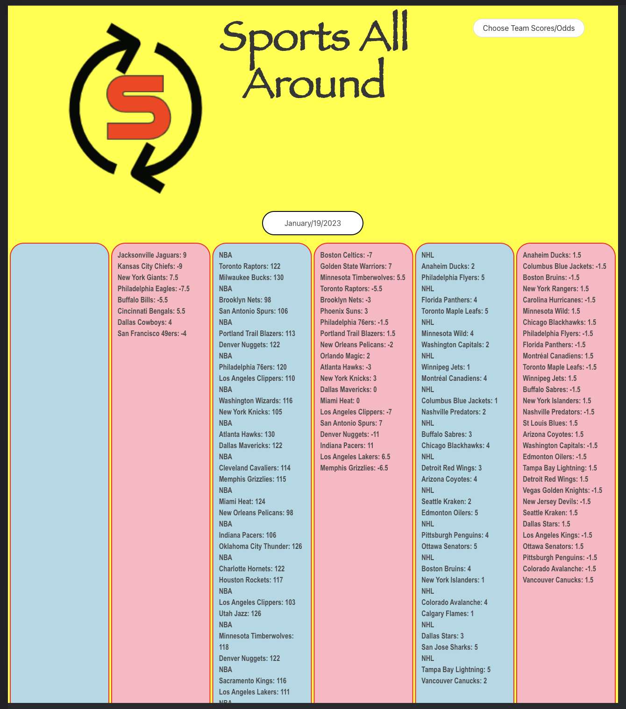
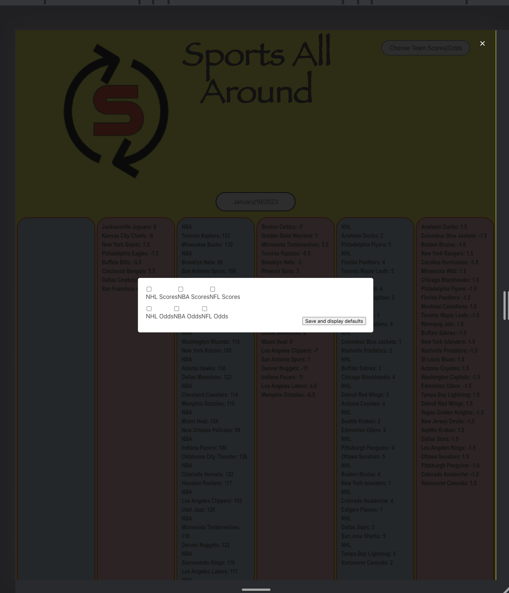

# Sports-All-Around-Public-Site

## Description

We were wanting to me a site where it was easy to see the live scores at a given point as well as betting lines associated with each game.  This was so that bettor would be able to have an add-free experience and focus on the lines to make smart up to date decisions.  The site will pull data from the Live Odds API with separate requests for the score and the odds.  The site also has the ability for the user to be able to show with only scores, odd, or certain scores and odds.  While we did this we were able to learn more about using multiple APIS and parsing through the data so that would could certain data rather than all of the data.  We were also to get a better grasp on how to work as a team breaking down the various tasks of HTML, CSS, and JavaScript.  In addition we learned about version control and how it relates to Github and working on branches, not the main, using pull and push requests to actually update the main.

The following is a link to the website [Sports-All-Around site] (https://sports-all-around.github.io/Sports-All-Around-Public-Site/)

## Usage

The following are some screenshots of the site in various aspects.

## Credits

Collaborators

Christopher Newell: https://github.com/Arms-like-trees 

Jonathon Emmert:https://github.com/JEmmert10 

Rehan Jetpuri:https://github.com/RehanJet 